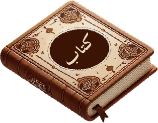
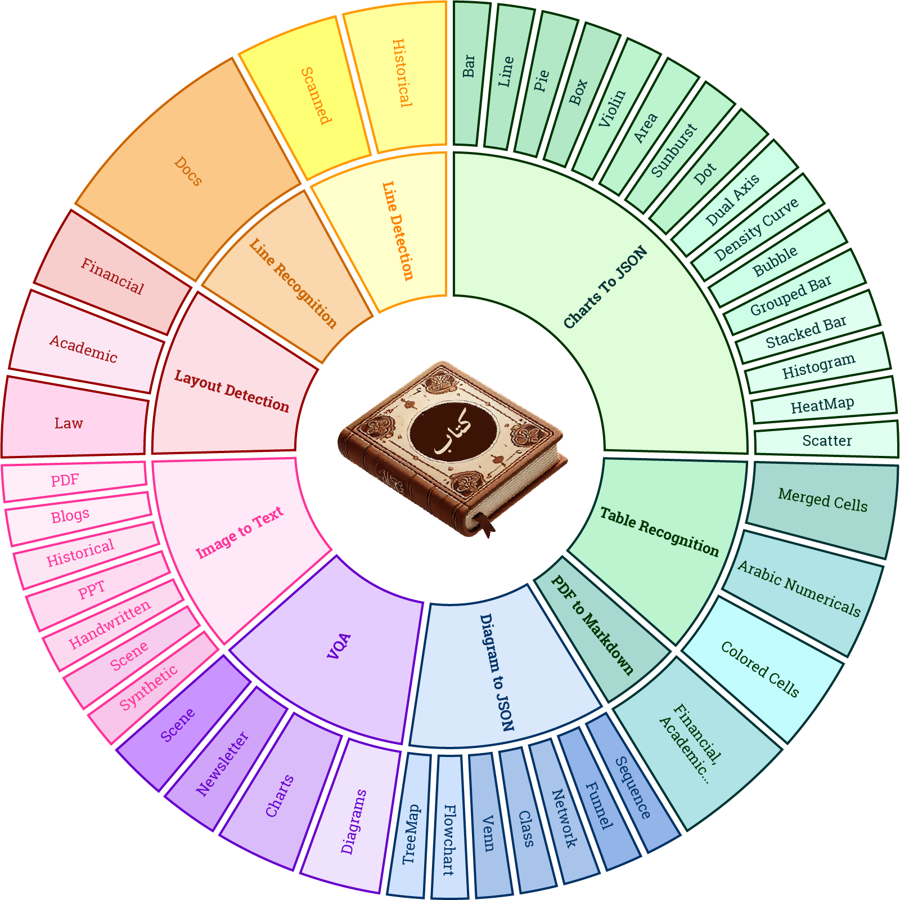
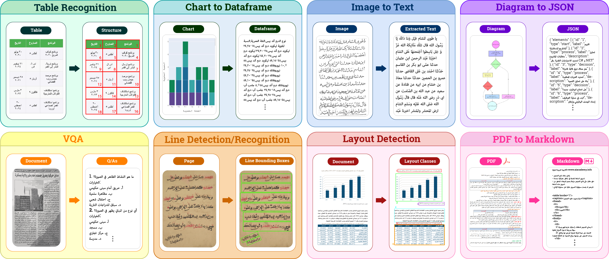
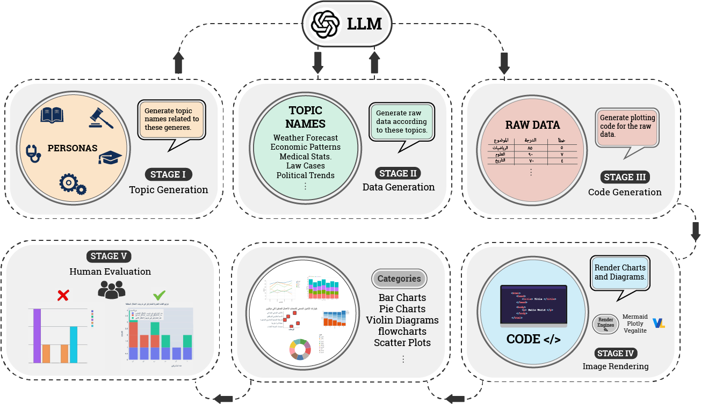
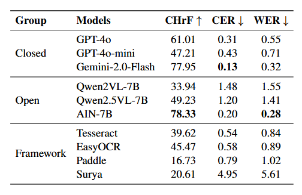
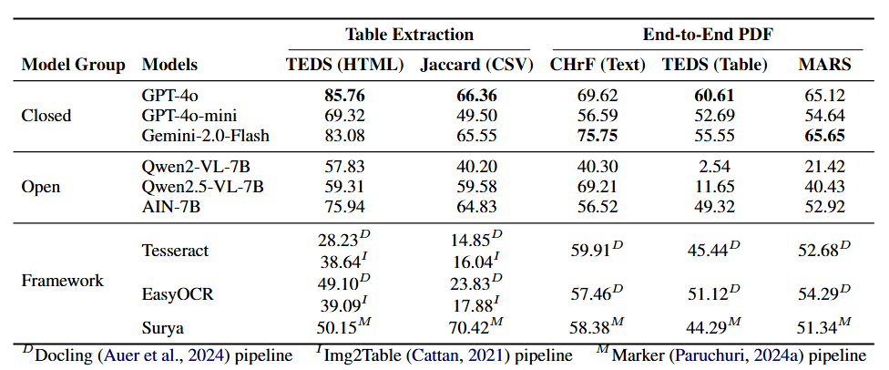
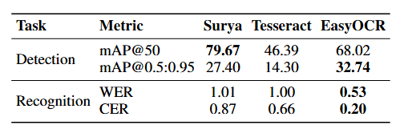
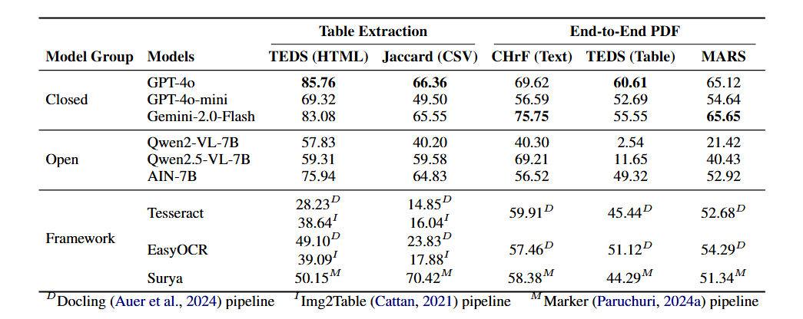
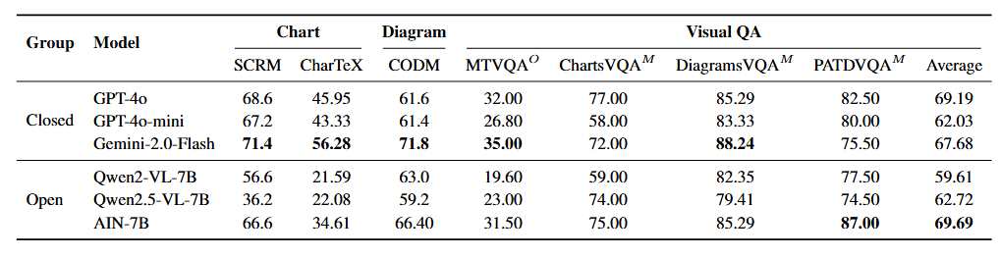
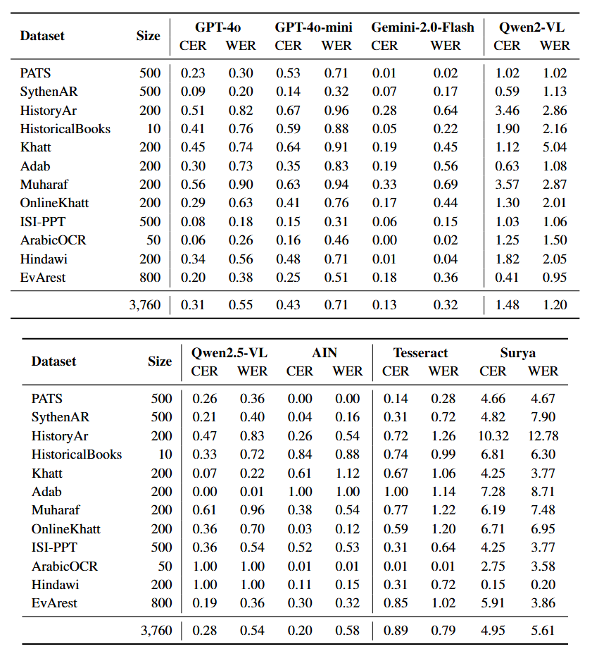

#  **KITAB-Bench: A Comprehensive Multi-Domain Benchmark for Arabic OCR and Document Understanding [ACL 2025 🔥]**


[Ahmed Heakl](https://huggingface.co/ahmedheakl) <sup> * </sup> &nbsp;
[Abdullah Sohail](https://github.com/AbdullahSohail15) <sup> * </sup> &nbsp;
[Mukul Ranjan](https://scholar.google.com/citations?user=fFBR0j0AAAAJ&hl=en)<sup> * </sup> &nbsp;
[Rania Hossam](https://scholar.google.com/citations?user=ic1jai8AAAAJ&hl=en)<sup> * </sup> &nbsp;
[Ghazi Shazan Ahmad](https://scholar.google.com/citations?hl=en&user=qxmI8TkAAAAJ) &nbsp;
[Mohamed El-Geish](https://www.linkedin.com/in/elgeish/) &nbsp;
[Omar Maher](https://www.linkedin.com/in/omaher/) &nbsp;
[Zhiqiang Shen](https://zhiqiangshen.com/)&nbsp;
[Fahad Shahbaz Khan](https://scholar.google.com/citations?hl=en&user=zvaeYnUAAAAJ) &nbsp;
[Salman Khan](https://scholar.google.com/citations?hl=en&user=M59O9lkAAAAJ)
<br>
<br>
<em> <sup> *Equal Contribution  </sup> </em>
<br>
  [](https://arxiv.org/abs/2502.14949)
  [](https://mbzuai-oryx.github.io/KITAB-Bench/)
  [](https://github.com/mbzuai-oryx/KITAB-Bench/issues)
  [](https://github.com/mbzuai-oryx/KITAB-Bench/stargazers)
  [](https://github.com/mbzuai-oryx/KITAB-Bench/blob/main/LICENSE)
  <br>

## 📌 Table of Contents
- [📖 Overview](#-overview)
- [🌟 Key Highlights](#-key-highlights)
- [📊 Dataset Overview](#-dataset-overview)
- [📂 Domains](#-domains)
- [📝 Benchmark Tasks](#-benchmark-tasks)
- [📸 Task Examples](#-task-examples)
- [🔄 Data Generation Pipeline](#-data-generation-pipeline)
- [📏 Evaluation Metrics](#-evaluation-metrics)
- [📊 Performance Results](#-performance-results)
- [⚙️ Installation & Usage](#-installation--usage)
- [📜 Citation](#-citation)

---
  
## 📖 **Overview**  
With the increasing adoption of **⚡ Retrieval-Augmented Generation (RAG)** in document processing, robust Arabic **🔍 Optical Character Recognition (OCR)** is essential for knowledge extraction. Arabic OCR presents unique challenges due to:  

- ✍️ **Cursive script** and **right-to-left text flow**.  
- 🖋️ **Complex typographic** and **calligraphic** variations.  
- 📊 **Tables, charts, and diagram-heavy documents**.  

We introduce **📚 KITAB-Bench**, a **comprehensive Arabic OCR benchmark** that evaluates the performance of **🤖 traditional OCR, vision-language models (VLMs), and specialized AI systems**.  

---

### 🌟 **Key Highlights**  
✅ **9️⃣ major domains & 36 sub-domains** across **📄 8,809 samples**.  
✅ **📜 Diverse document types**: PDFs, ✍️ handwritten text, 🏦 structured tables, ⚖️ financial & legal reports.  
✅ **Strong baselines**: Benchmarked against **Tesseract, GPT-4o, Gemini, Qwen**, and more.  
✅ **Evaluation across OCR, layout detection, table recognition, chart extraction, & PDF conversion.**  
✅ **Novel evaluation metrics**: **Markdown Recognition (MARS), Table Edit Distance (TEDS), Chart Data Extraction (SCRM).**  


---

🚀 **KITAB-Bench sets a new standard for Arabic OCR evaluation, enabling more accurate, efficient, and intelligent document understanding!** 📖✨


---

## **Dataset Overview**
KITAB-Bench covers a **wide range of document types**:

| **Domain**            | **Total Samples** |
|----------------------|-----------------|
| PDF-to-Markdown      | 33              |
| Layout Detection     | 2,100           |
| Line Recognition     | 378             |
| Table Recognition    | 456             |
| Charts-to-DataFrame  | 576             |
| Diagram-to-JSON      | 226             |
| Visual QA (VQA)      | 902             |
| **Total**            | **8,809**        |

📌 **High-quality human-labeled annotations** for fair evaluation.

---

## **Domains**
<p align="center">

</p>

## **Benchmark Tasks**
KITAB-Bench evaluates **9 key OCR and document processing tasks**:

1️⃣ [**Text Recognition (OCR)**](#large-vision-language-models-on-kitab-bench) - Printed & handwritten Arabic OCR.  
2️⃣ [**Layout Detection**](#layout-detection) - Extracting text blocks, tables, figures, etc.  
3️⃣ [**Line Detection**](#line-detection-and-recognition) - Identifying & recognizing individual Arabic text lines.  
4️⃣ [**Line Recognition**](#line-detection-and-recognition) - Recognizing individual Arabic text lines accurately.  
5️⃣ [**Table Recognition**](#table-recognition-and-pdf-to-markdown) - Parsing structured tables into machine-readable formats.  
6️⃣ [**PDF-to-Markdown**](#table-recognition-and-pdf-to-markdown) - Converting Arabic PDFs into structured Markdown format.  
7️⃣ [**Charts-to-DataFrame**](#chart-and-diagram-vqa) - Extracting **21 types of charts** into structured datasets.  
8️⃣ [**Diagram-to-JSON**](#chart-and-diagram-vqa) - Extracting **flowcharts, Venn diagrams, networks into JSON.**  
9️⃣ [**Visual Question Answering (VQA)**](#chart-and-diagram-vqa) - Understanding questions about Arabic documents.  
  

---
### **Task Examples**
<p align="center">

</p>

### **Data Generation pipeline**
<p align="center">

</p>

## **Evaluation Metrics**
To accurately assess OCR models, KITAB-Bench introduces **new Arabic OCR evaluation metrics**:

| **Metric** | **Purpose** |
|------------|------------|
| **Character Error Rate (CER)** | Measures accuracy of recognized characters. |
| **Word Error Rate (WER)** | Evaluates word-level OCR accuracy. |
| **MARS (Markdown Recognition Score)** | Assesses **PDF-to-Markdown conversion** accuracy. |
| **TEDS (Tree Edit Distance Score)** | Measures **table extraction correctness**. |
| **SCRM (Chart Representation Metric)** | Evaluates **chart-to-data conversion**. |
| **CODM (Code-Oriented Diagram Metric)** | Assesses **diagram-to-JSON extraction accuracy**. |

📌 **KITAB-Bench ensures a rigorous evaluation across multiple dimensions of Arabic document processing.**

---

## **Performance Results**

### **Text Recognition (OCR)**
<p align="center">

</p>

### **Layout Detection**
<p align="center">

</p>

### **Line Detection and Recognition**
<p align="center">

</p>

### **Table Recognition and PDF to Markdown**
<p align="center">

</p>

### **Chart and Diagram VQA**
<p align="center">

</p>

### **Large Vision-Language Models on KITAB-Bench**
<p align="center">

</p>

Our benchmark results demonstrate **significant performance gaps** between different OCR systems:

| **Model** | **OCR Accuracy (CER%)** | **Table Recognition (TEDS%)** | **Charts-to-Data (SCRM%)** |
|----------|--------------------|-----------------|------------------|
| GPT-4o    | **31.0%** | 85.7% | 68.6% |
| Gemini-2.0 | **13.0%** | 83.0% | 71.4% |
| Qwen-2.5 | **49.2%** | 59.3% | 36.2% |
| EasyOCR  | **58.0%** | 49.1% | N/A |
| Tesseract | **54.0%** | 28.2% | N/A |

📌 **Key Insights**:  
✅ **GPT-4o and Gemini models significantly outperform traditional OCR**.  
✅ **Surya and Tesseract perform well for standard text but fail in table and chart recognition**.  
✅ **Open-source models like Qwen-2.5 still lag behind proprietary solutions**.

---

## **Installation & Usage**
To use KITAB-Bench, follow these steps:

### **1️⃣ Clone the Repository**
```bash
git clone https://github.com/mbzuai-oryx/KITAB-Bench.git
cd KITAB-Bench
```
###  **2️⃣ Layout Evaluation**
```bash
cd layout-eval
pip3 install -r requirements.txt
# Evaluate a single model (RT-DETR, Surya, or YOLO) on BCE Layout dataset
python rt_detr_bcelayout.py
python test_surya_bce_layout.py
python yolo_doc_bcelayout.py

# Evaluate a single model on DocLayNet dataset
python rt_detr_doclayout.py
python test_surya_doclaynet.py
python yolo_doc_doclayout.py

# Evaluate all models at once
python main.py
```

### **3️⃣ VQA Evaluation**
Available models are Gemini-2.0-Flash, InternVL-2.5, GPT-4o, GPT-4o-mini, Qwen2-VL, and Qwen2.5-VL.

```bash
cd vqa-eval
pip3 install -r requirements.txt
python3 eval.py --model_name qwen2_vl # get predictions
python3 metrics.py --model_name qwen2_vl # get exact match accuracy
```

### **4️⃣ Tables Evaluation**
Available models are Docling (Tesseract, EasyOCR), Gemini-2.0-Flash, Img2Table (EasyOCR, Tesseract), Marker, GPT-4o, GPT-4o-mini, Qwen2-VL, and Qwen2.5-VL.
```bash
cd tables-eval
pip3 install -r requirements.txt
python3 eval.py --model_name qwen2_vl # get predictions
python3 metrics.py --model_name qwen2_vl # get TEDS and Jaccord index accuracy
```

### **5️⃣ Lines Detection & Recognition Evaluation**
Available models are EasyOCR, Surya, Tesseract.
```bash
cd lines-eval
pip3 install -r requirements.txt
python3 eval.py --model_name easyocr # get predictions
python3 metric.py --model_name easyocr # get mAP and CER scores
```

### **6️⃣ OCR Evaluation**
Available models are EasyOCR, Surya, Tesseract, Gemini-2.0-Flash, GPT-4o, GPT-4o-mini, Qwen2-VL, Qwen2.5-VL, AtlasOCR, and PaddleOCR. 
```bash
cd ocr-eval
pip3 install -r requirements.txt
python3 eval.py --model_name easyocr # get predictions
python3 metrics.py --model_name easyocr # get CER, WER, BLEU, chrF, and METEOR scores
```

### **7️⃣ PDF-to-Markdown Evaluation**
Available models are Docling (Tesseract, EasyOCR), Marker, Gemini-2.0-Flash, GPT-4o, GPT-4o-mini, Qwen2-VL and Qwen2.5-VL. 
```bash
cd pdfs-eval
pip3 install -r requirements.txt
python3 eval.py --model_name doclingeasyocr # get predictions
python3 metrics.py --model_name doclingeasyocr # get MARS (markdown recognition score)
```

### **8️⃣ Charts Evaluation**
Available models are Gemini-2.0-Flash, GPT-4o, GPT-4o-mini, Qwen2-VL and Qwen2.5-VL. 
```bash
cd charts-eval
python3 eval.py --model_name qwen2vl # get predictions
python3 metrics.py --model_name qwen2vl # get SCRM and ChartEx scores
```

> If you are using GPT-4o or GPT-4o-mini, please put an environment variable `export OPENAI_API_KEY=<your-api-key>`

> If you are using Gemini, please put an environment variable `export GEMINI_API_KEY=<your-api-key>`

Diagrams evaluations are coming soon ...

If you're using KITAB-Bench in your research or applications, please cite using this BibTeX:
```bibtex
  @misc{heakl2025kitab,
        title={KITAB-Bench: A Comprehensive Multi-Domain Benchmark for Arabic OCR and Document Understanding}, 
        author={Ahmed Heakl and Abdullah Sohail and Mukul Ranjan and Rania Hossam and Ghazi Ahmed and Mohamed El-Geish and Omar Maher and Zhiqiang Shen and Fahad Khan and Salman Khan},
        year={2025},
        eprint={2502.14949},
        archivePrefix={arXiv},
        primaryClass={cs.CV},
        url={https://arxiv.org/abs/2502.14949}, 
  }
```
