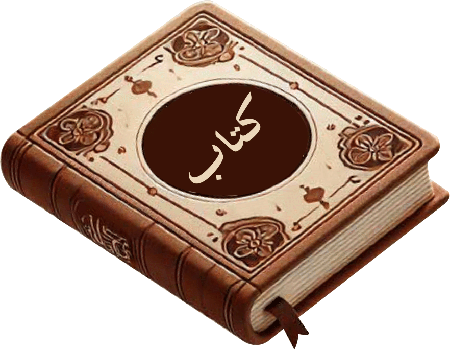

#  **KITAB-Bench: A Comprehensive Multi-Domain Benchmark for Arabic OCR and Document Understanding**


[Ahmed Heakl](https://huggingface.co/ahmedheakl) <sup> * </sup> &nbsp;
[Abdullah Sohail](https://github.com/AbdullahSohail15) <sup> * </sup> &nbsp;
[Mukul Ranjan](https://scholar.google.com/citations?user=fFBR0j0AAAAJ&hl=en)<sup> * </sup> &nbsp;
[Rania Hossam](https://scholar.google.com/citations?user=ic1jai8AAAAJ&hl=en)<sup> * </sup> &nbsp;
[Ghazi Shazan Ahmad](https://scholar.google.com/citations?hl=en&user=qxmI8TkAAAAJ) &nbsp;
[Mohamed El-Geish](https://www.linkedin.com/in/elgeish/) &nbsp;
[Omar Maher](https://www.linkedin.com/in/omaher/) &nbsp;
[Zhiqiang Shen](https://zhiqiangshen.com/)&nbsp;
[Fahad Shahbaz Khan](https://scholar.google.com/citations?hl=en&user=zvaeYnUAAAAJ) &nbsp;
[Salman Khan](https://scholar.google.com/citations?hl=en&user=M59O9lkAAAAJ)
<br>
<br>
<em> <sup> *Equal Contribution  </sup> </em>
<br>
  [](https://arxiv.org/abs/2502.14949)
  [](https://mbzuai-oryx.github.io/KITAB-Bench/)
  [](https://github.com/mbzuai-oryx/KITAB-Bench/issues)
  [](https://github.com/mbzuai-oryx/KITAB-Bench/stargazers)
  [](https://github.com/mbzuai-oryx/KITAB-Bench/blob/main/LICENSE)
  <br>
## **Overview**
With the increasing adoption of **Retrieval-Augmented Generation (RAG)** in document processing, robust Arabic **Optical Character Recognition (OCR)** is essential for knowledge extraction. Arabic OCR presents unique challenges due to:
- **Cursive script** and **right-to-left text flow**.
- **Complex typographic** and **calligraphic** variations.
- **Tables, charts, and diagram-heavy documents**.

We introduce **KITAB-Bench**, a **comprehensive Arabic OCR benchmark** that evaluates the performance of **traditional OCR, vision-language models (VLMs), and specialized AI systems**.

### **Key Highlights**
✅ **9 major domains & 36 sub-domains** across **8,809** samples.  
✅ **Diverse document types**: PDFs, handwritten text, structured tables, financial & legal reports.  
✅ **Strong baselines**: Benchmarked against **Tesseract, GPT-4o, Gemini, Qwen**, and more.  
✅ **Evaluation across OCR, layout detection, table recognition, chart extraction, & PDF conversion.**  
✅ **Novel evaluation metrics**: Markdown Recognition (MARS), Table Edit Distance (TEDS), Chart Data Extraction (SCRM).  

---

## **Dataset Overview**
KITAB-Bench covers a **wide range of document types**:

| **Domain**            | **Total Samples** |
|----------------------|-----------------|
| PDF-to-Markdown      | 33              |
| Layout Detection     | 2,100           |
| Line Recognition     | 378             |
| Table Recognition    | 456             |
| Charts-to-DataFrame  | 576             |
| Diagram-to-JSON      | 226             |
| Visual QA (VQA)      | 902             |
| **Total**            | **8,809**        |

📌 **High-quality human-labeled annotations** for fair evaluation.

---
## **Domains**
<p align="center">

</p>
## **Benchmark Tasks**
KITAB-Bench evaluates **9 key OCR and document processing tasks**:

1️⃣ **Text Recognition (OCR)** - Printed & handwritten Arabic OCR.  
2️⃣ **Layout Detection** - Extracting text blocks, tables, figures, etc.  
3️⃣ **Line Recognition** - Identifying & recognizing individual Arabic text lines.  
4️⃣ **Table Recognition** - Parsing structured tables into machine-readable formats.  
5️⃣ **PDF-to-Markdown** - Converting Arabic PDFs into structured Markdown format.  
6️⃣ **Charts-to-DataFrame** - Extracting **21 types of charts** into structured datasets.  
7️⃣ **Diagram-to-JSON** - Extracting **flowcharts, Venn diagrams, networks into JSON.**  
8️⃣ **Visual Question Answering (VQA)** - Understanding questions about Arabic documents.  
9️⃣ **Semantic Reasoning** - Analyzing **complex text layouts, diagrams, and mixed formats.**  

---
### **Task Examples**
<p align="center">

</p>

### **Data Generation pipeline**
<p align="center">

</p>

## **Evaluation Metrics**
To accurately assess OCR models, KITAB-Bench introduces **new Arabic OCR evaluation metrics**:

| **Metric** | **Purpose** |
|------------|------------|
| **Character Error Rate (CER)** | Measures accuracy of recognized characters. |
| **Word Error Rate (WER)** | Evaluates word-level OCR accuracy. |
| **MARS (Markdown Recognition Score)** | Assesses **PDF-to-Markdown conversion** accuracy. |
| **TEDS (Tree Edit Distance Score)** | Measures **table extraction correctness**. |
| **SCRM (Chart Representation Metric)** | Evaluates **chart-to-data conversion**. |
| **CODM (Code-Oriented Diagram Metric)** | Assesses **diagram-to-JSON extraction accuracy**. |

📌 **KITAB-Bench ensures a rigorous evaluation across multiple dimensions of Arabic document processing.**

---

## **Performance Results**

### **Layout Detection**
<p align="center">

</p>
### **Table Detection**
<p align="center">

</p>
### **Chart and Diagram VQA**
<p align="center">

</p>
### **Large Vision-Language Models on KITAB-Bench**
<p align="center">

</p>

Our benchmark results demonstrate **significant performance gaps** between different OCR systems:

| **Model** | **OCR Accuracy (CER%)** | **Table Recognition (TEDS%)** | **Charts-to-Data (SCRM%)** |
|----------|--------------------|-----------------|------------------|
| GPT-4o    | **31.0%** | 85.7% | 68.6% |
| Gemini-2.0 | **13.0%** | 83.0% | 71.4% |
| Qwen-2.5 | **49.2%** | 59.3% | 36.2% |
| EasyOCR  | **58.0%** | 49.1% | N/A |
| Tesseract | **54.0%** | 28.2% | N/A |

📌 **Key Insights**:  
✅ **GPT-4o and Gemini models significantly outperform traditional OCR**.  
✅ **Surya and Tesseract perform well for standard text but fail in table and chart recognition**.  
✅ **Open-source models like Qwen-2.5 still lag behind proprietary solutions**.

---

## **Installation & Usage**
To use KITAB-Bench, follow these steps:

### **1️⃣ Clone the Repository**
```bash
git clone https://github.com/mbzuai-oryx/KITAB-Bench.git
cd KITAB-Bench
```
###  **2️⃣ Layout Evaluation**
```bash
cd layout-eval
pip3 install -r requirements.txt
# Evaluate a single model (RT-DETR, Surya, or YOLO) on BCE Layout dataset
python rt_detr_bcelayout.py
python test_surya_bce_layout.py
python yolo_doc_bcelayout.py

# Evaluate a single model on DocLayNet dataset
python rt_detr_doclayout.py
python test_surya_doclaynet.py
python yolo_doc_doclayout.py

# Evaluate all models at once
python evaluate_all.py
```

### **3️⃣ VQA Evaluation**
Available models are Gemini-2.0-Flash, InternVL-2.5, GPT-4o, GPT-4o-mini, Qwen2-VL, and Qwen2.5-VL.
```bash
cd vqa-eval
pip3 install -r requirements.txt
python3 eval.py --model_name qwen2_vl # get predictions
python3 metrics.py --model_name qwen2_vl # get exact match accuracy
```

### **4️⃣ Tables Evaluation**
Available models are Docling (Tesseract, EasyOCR), Gemini-2.0-Flash, Img2Table (EasyOCR, Tesseract), Marker, GPT-4o, GPT-4o-mini, Qwen2-VL, and Qwen2.5-VL.
```bash
cd tables-eval
pip3 install -r requirements.txt
python3 eval.py --model_name qwen2_vl # get predictions
python3 metrics.py --model_name qwen2_vl # get TEDS and Jaccord index accuracy
```

### **5️⃣ Lines Detection & Recognition Evaluation**
Available models are EasyOCR, Surya, Tesseract.
```bash
cd lines-eval
pip3 install -r requirements.txt
python3 eval.py --model_name easyocr # get predictions
python3 metric.py --model_name easyocr # get mAP and CER scores
```

OCR, Charts, Diagrams, and PDF-to-Markdown evaluations are coming soon ...

If you're using KITAB-Bench in your research or applications, please cite using this BibTeX:
```bibtex
  @misc{heakl2025kitab,
        title={KITAB-Bench: A Comprehensive Multi-Domain Benchmark for Arabic OCR and Document Understanding}, 
        author={Ahmed Heakl and Abdullah Sohail and Mukul Ranjan and Rania Hossam and Ghazi Ahmed and Mohamed El-Geish and Omar Maher and Zhiqiang Shen and Fahad Khan and Salman Khan},
        year={2025},
        eprint={2502.14949},
        archivePrefix={arXiv},
        primaryClass={cs.CV},
        url={https://arxiv.org/abs/2502.14949}, 
  }
```
